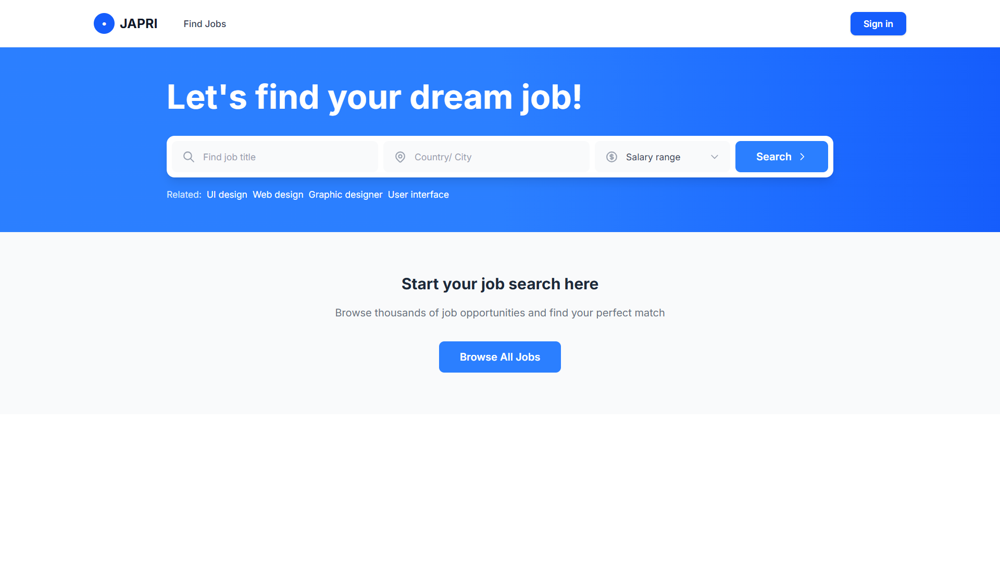
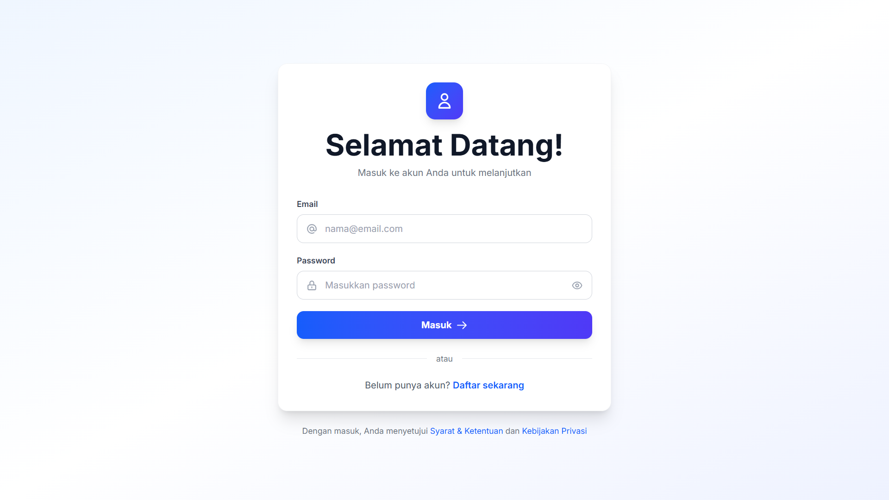
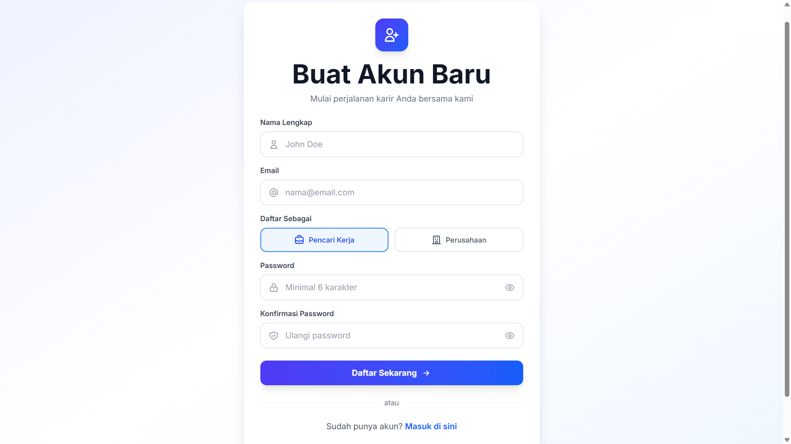
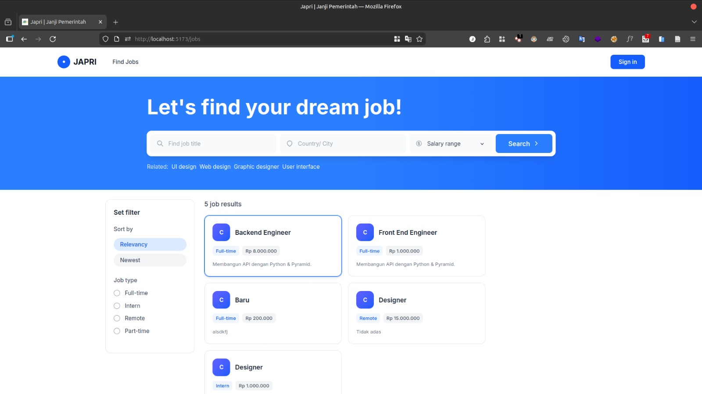
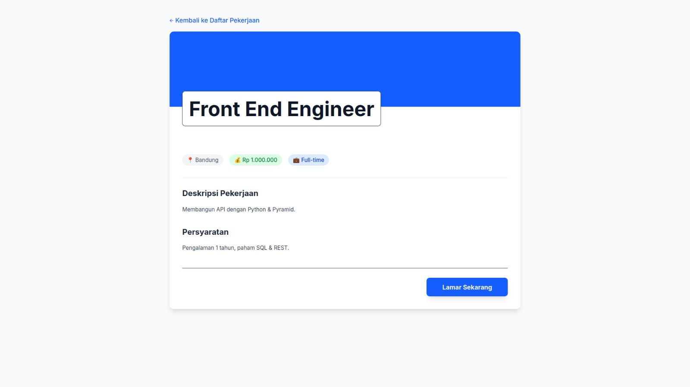
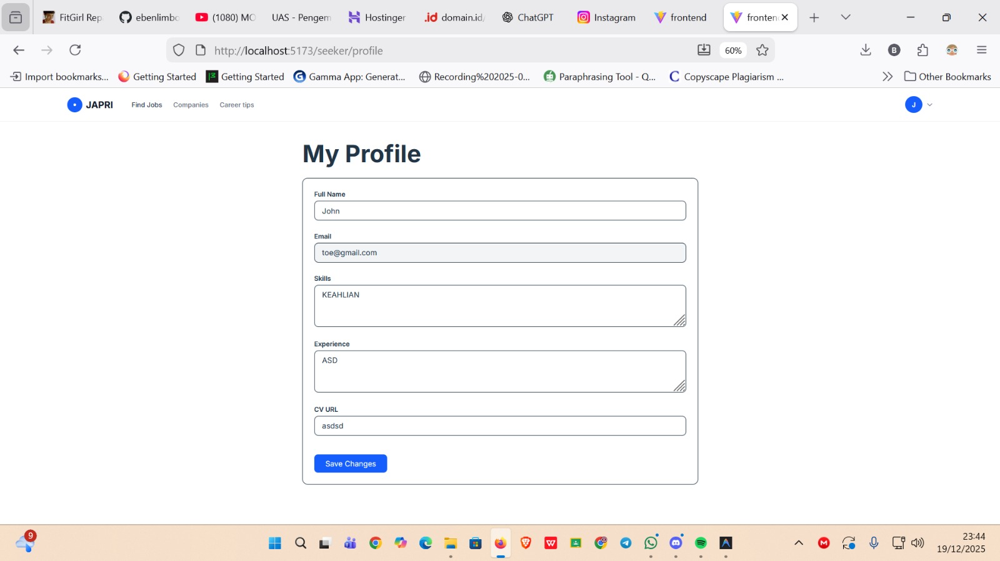
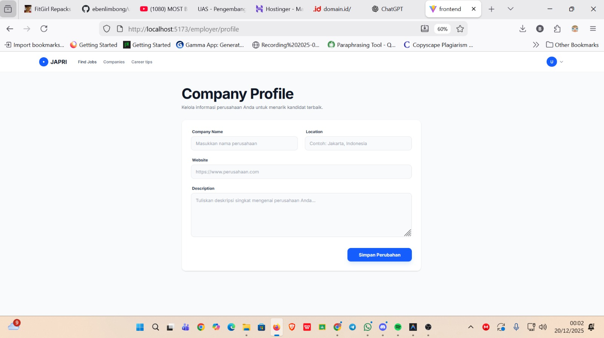

# 🚀 JAPRI (JANJI PEMERINTAH) - Platform Pencarian Kerja

**UAS Pengembangan Aplikasi Web (PAW) - Kelompok 8 "JAPRI"**

---

## 👥 Tim & Anggota

| No | Nama | NIM | Role |
|----|------|-----|------|
| 1 | **Ebentua Philippus Limbong** | 123140086 | Team Leader & Fullstack Developer |
| 2 | Muhammad Bintang Al Fasya | 123140098 | Fullstack Developer |
| 3 | Agus Subekti | 123140104 | Fullstack Developer |
| 4 | Rifael Eurico Sitorus | 123140077 | Fullstack Developer |
| 5 | Andika Rahman Pratama | 123140090 | Fullstack Developer |
| 6 | Ahmat Prayoga Sembiring | 123140053 | Fullstack Developer |

---

## 📋 Deskripsi Project

**Japri (JANJI PEMERINTAH) - Platform Pencarian Kerja** adalah platform pencarian kerja berbasis web yang menghubungkan pencari kerja (Job Seeker) dengan perusahaan (Employer). Aplikasi ini memungkinkan pengguna untuk mencari lowongan pekerjaan, melamar pekerjaan, dan mengelola profil mereka dengan mudah.

### ✨ Fitur Utama

#### Untuk Job Seeker:
- 🔐 **Autentikasi** - Register & Login dengan JWT Token
- 🏠 **Home Page** - Halaman utama dengan informasi lowongan terbaru
- 🔍 **Pencarian Lowongan** - Cari dan filter lowongan kerja
- 📄 **Detail Lowongan** - Lihat detail lengkap lowongan pekerjaan
- 📝 **Apply Pekerjaan** - Melamar pekerjaan secara langsung
- 💾 **Saved Jobs** - Simpan lowongan favorit
- 👤 **Profil Seeker** - Kelola profil pencari kerja
- 📋 **My Applications** - Lihat status lamaran yang sudah diajukan

#### Untuk Employer:
- 🏢 **Company Profile** - Kelola profil perusahaan
- 📊 **View Applicants** - Lihat daftar pelamar pada lowongan
- ✅ **Update Status** - Update status lamaran (accepted/rejected)

---

## 🛠️ Tech Stack

### Frontend
| Technology | Version | Description |
|------------|---------|-------------|
| React | 19.2.0 | Library untuk membangun UI |
| Vite | 7.2.4 | Build tool dan development server |
| React Router DOM | 7.10.1 | Routing untuk navigasi halaman |
| TailwindCSS | 4.1.17 | Utility-first CSS framework |

### Backend
| Technology | Description |
|------------|-------------|
| Python | Bahasa pemrograman utama |
| Pyramid | Web framework Python |
| SQLAlchemy | ORM untuk database |
| PostgreSQL | Database |
| JWT | Autentikasi berbasis token |

---

## 🚀 Cara Instalasi & Menjalankan

### Prerequisites
- Node.js (v18 atau lebih baru)
- Python (v3.8 atau lebih baru)
- pip (Python package manager)

### 1. Clone Repository
```bash
git clone https://github.com/uas-paw-8-japri.git
cd uas-paw-8-japri
```

### 2. Setup Backend

```bash


# Buat virtual environment
python -m venv venv

# Aktifkan virtual environment
# Linux/Mac:
source venv/bin/activate
# Windows:
venv\Scripts\activate

# Install dependencies
(venv) pip install -r requirements.txt

# Masuk ke folder backend
cd backend

# Jalankan backend server
pserve development.ini --reload
(Biarkan terminal ini tetap terbuka dan berjalan.)
```

Backend akan berjalan di: `http://localhost:6543`

### 3. Setup Frontend

```bash
# Buka terminal baru, masuk ke folder frontend
cd frontend

# Install dependencies
npm install

# Jalankan development server
npm run dev
```

Frontend akan berjalan di: `http://localhost:5173`

---

## 🌐 Link Deployment

Frontend: https://japri.vercel.app/
Backend: Soon!

> ⚠️ *Link deployment akan diupdate setelah proses deployment selesai*🙏

---

## 📚 API Documentation

### Base URL
```
http://localhost:6543/api
```

### Authentication Endpoints

| Method | Endpoint | Description | Request Body |
|--------|----------|-------------|--------------|
| POST | `/register` | Registrasi user baru | `{ "username": "string", "email": "string", "password": "string", "role": "seeker/employer" }` |
| POST | `/login` | Login user | `{ "email": "string", "password": "string" }` |
| GET | `/auth/me` | Get current user | - (Header: Authorization) |

### Jobs Endpoints

| Method | Endpoint | Description |
|--------|----------|-------------|
| GET | `/jobs` | Get semua lowongan |
| GET | `/jobs/search?q={query}` | Search lowongan |
| GET | `/jobs/{id}` | Get detail lowongan |
| POST | `/jobs` | Buat lowongan baru (Employer) |
| PUT | `/jobs/{id}` | Update lowongan (Employer) |
| DELETE | `/jobs/{id}` | Hapus lowongan (Employer) |

### Application Endpoints

| Method | Endpoint | Description |
|--------|----------|-------------|
| POST | `/jobs/{id}/apply` | Apply ke lowongan (Seeker) |
| GET | `/applications/me` | Get lamaran saya (Seeker) |
| GET | `/jobs/{job_id}/applications` | Get pelamar (Employer) |
| PUT | `/applications/{id}/status` | Update status lamaran (Employer) |

### Saved Jobs Endpoints

| Method | Endpoint | Description |
|--------|----------|-------------|
| POST | `/jobs/{id}/save` | Simpan lowongan |
| GET | `/saved_jobs/me` | Get saved jobs |
| DELETE | `/saved-jobs/{id}` | Hapus saved job |

### Profile Endpoints

| Method | Endpoint | Description |
|--------|----------|-------------|
| GET | `/profile/me` | Get profil seeker |
| PUT | `/profile/me` | Update profil seeker |
| GET | `/company/me` | Get profil company |
| PUT | `/company/me` | Update profil company |
| GET | `/company/{id}` | Get public company profile |

### Response Format

**Success Response:**
```json
{
  "success": true,
  "data": { ... },
  "message": "Operation successful"
}
```

**Error Response:**
```json
{
  "success": false,
  "error": "Error message",
  "message": "Detailed error description"
}
```

### Authentication Header
```
Authorization: Bearer <jwt_token>
```

---

## 📸 Screenshot Aplikasi


### Halaman Utama (Home)


### Halaman Login


### Halaman Register


### Halaman Daftar Lowongan


### Halaman Detail Lowongan


### Halaman Profil Seeker


### Halaman Profil Employer


---

## 🎥 Video Presentasi

[Tonton Video Presentasi](https://drive.google.com/file/d/1dR29DiKOkBJKoIe3hFd26sJu3v3IcnVT/view?usp=sharing)

---

## 📄 Lisensi

Project ini dibuat untuk keperluan akademis - **UAS Pengembangan Aplikasi Web (PAW)**

---

<p align="center">
  Made with ❤️ by <strong>Team JAPRI (JANJI PEMERINTAH)</strong>
</p>
